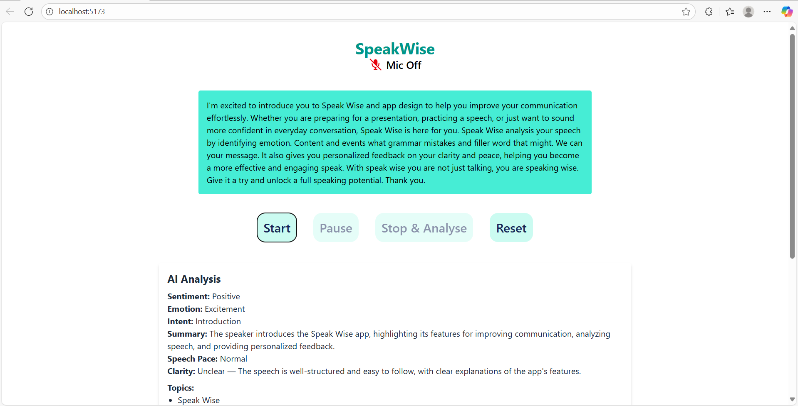
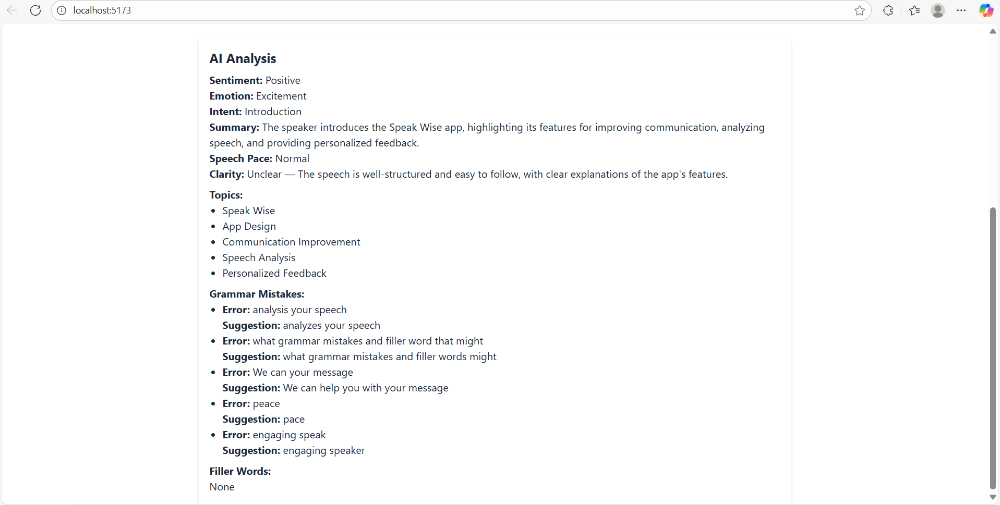
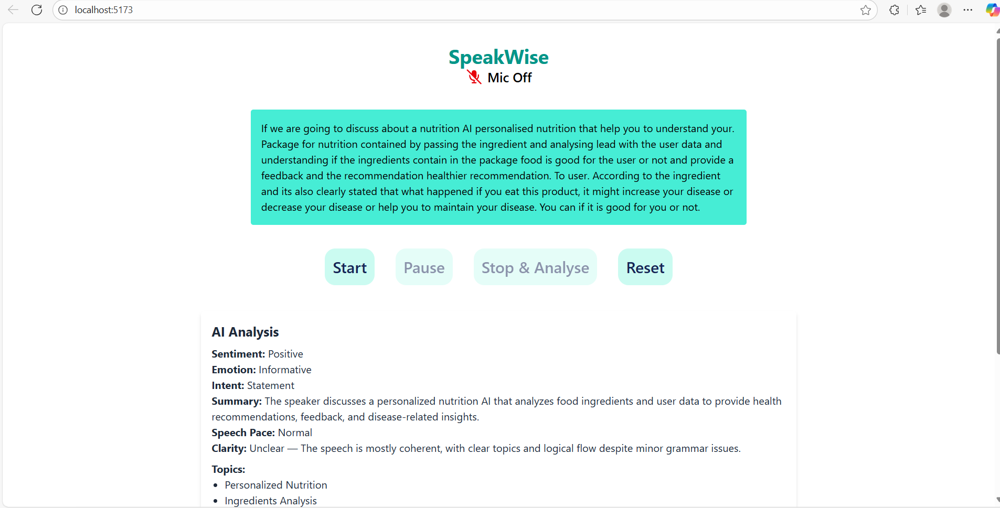
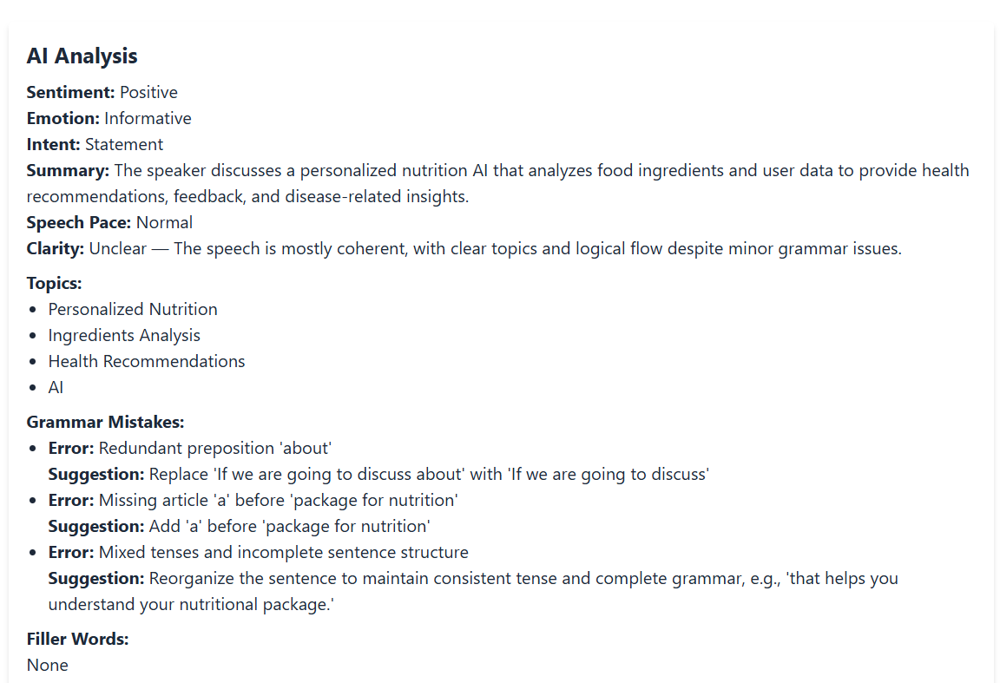

# SpeakWise – Frontend

SpeakWise is a web application designed to help users improve their communication skills effortlessly. Whether you are preparing for a presentation, practicing a speech, or simply want to sound more confident in everyday conversation, SpeakWise provides real-time analysis and feedback to enhance your speaking potential.

The frontend is built using **React.js** and **Tailwind CSS** to deliver a clean, responsive, and user-friendly interface.

---

## ✨ Features

- Real-time speech analysis UI
- Displays sentiment, emotion, intent, clarity, speech pace, grammar mistakes, filler words, and topics
- Buttons to Start, Pause, Stop & Analyse, and Reset
- Responsive design for desktop and mobile

---

## 🛠️ Tech Stack

- **React.js** – Component-based frontend  
- **Tailwind CSS** – Utility-first CSS framework  

---
## 🖼️ Screenshots

### Hero Section 1  





## 🚀 Getting Started

1. Clone the repository:
   ```bash
   git clone https://github.com/Aaliyakhan10/speakwise-frontend
   cd speakwise-frontend
   npm install
   npm start
